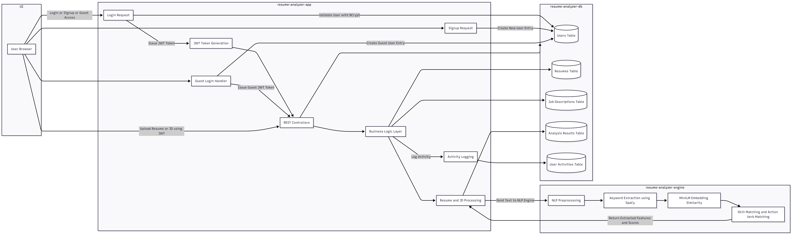

# 🧠 Resume Analyzer

**AI-driven Resume Intelligence Platform built with Spring Boot, FastAPI, and NLP — helping job seekers and recruiters bridge the hiring gap through intelligent resume–JD matching, skill extraction, and ATS optimization.**

---

## 🚀 Overview

Resume Analyzer intelligently parses resumes and job descriptions, extracts skills and roles using NLP, and computes a fit score based on embeddings and semantic similarity.  
The system enables job seekers to identify missing keywords, recruiters to shortlist efficiently, and developers to explore real-world microservice architecture with NLP integration.

This project demonstrates clean, modular, production-style design — blending Spring Boot (Java) for backend orchestration and FastAPI (Python) for the NLP/ML microservice — fully Dockerized for easy deployment.

---

## ⚙️ Tech Stack

| Layer | Technology |
|-------|-------------|
| **Backend** | Spring Boot · Spring Data JPA · Spring Security · JWT Auth · MySQL |
| **Frontend/UI** | HTML · CSS · Vanilla JavaScript · Thymeleaf Templates |
| **NLP Service** | Python · FastAPI · SpaCy (md model) · MiniLM Transformers · PyTorch |
| **Parsing** | Apache Tika (PDF/DOCX/Text Parsing) |
| **Architecture** | Microservices · RESTful Communication (HTTP + WebClient) · Clean Modular Layers |
| **DevOps** | Docker · Docker Compose |

---

## 💡 Key Features

### 🧾 Resume & JD Management
- Upload resumes and job descriptions (supports `.pdf`, `.docx`, `.txt`)
- Extract and store text content via Apache Tika
- Persist data in MySQL using Spring Data JPA

### 🧠 NLP-Powered Skill & Role Extraction
- Extract skills, titles, qualifications, and verbs from both resumes and JDs  
- Uses SpaCy (NER, noun-chunking) + MiniLM Transformers for embeddings  
- Computes semantic similarity (via cosine similarity using PyTorch)

### ⚖️ Smart Comparison & Scoring
- Compares extracted data between Resume ↔ JD  
- Generates a Fit Score based on skills, roles, action words and qualifications overlap  
- Identifies missing keywords and improvement areas  
- Generates a PDF report for download

### 👤 User Authentication & Security
- JWT-based authentication using Spring Security  
- Password hashing with BCrypt  
- Role-based access (User/Admin)  
- Custom Security Filter Chains and secured REST endpoints

### 📊 Dashboards & Insights
- **User Dashboard:** manage resumes, job descriptions, and reports  
- JD Dashboard / Resume Dashboard / Analysis Dashboard  
- Recent Activities Page for tracking user actions  
- Interactive charts and visualizations  
- Search and filter by name, company, title, or date  
- Change password, update user details, delete account

### 🎨 UI & Experience
- Built with Thymeleaf, HTML, CSS, and Vanilla JS  
- Clean and responsive layout  
- Modals, alerts, and visualization charts  
- Guest access mode to try the analyzer without signup

---

## 🧩 Architecture Overview

The **Resume Analyzer system** is designed using a modular **microservices architecture**, with clear separation of concerns between the application layer, ML/NLP engine, and data storage. Each component runs independently and communicates through REST APIs and is deployed using Docker for consistency across environments.

---

## Architecture Diagram



## **1. Spring Boot Application (`resume-analyzer-app`)**

This is the **core backend + UI** service.  
It provides REST APIs, authentication, business logic, dashboards, and the Thymeleaf-based user interface.

### **Key Responsibilities**

- **REST API Layer**  
  Handles résumé upload, JD upload, ATS scoring, keyword gap analysis, and analysis report generation.

- **UI Layer**  
  Built using Thymeleaf templates and Vanilla JavaScript for a clean, interactive UI experience.

- **Business Logic Orchestration**  
  Delegates all NLP-heavy processing to the ML Engine and merges the results into final ATS reports.

- **Authentication & Security**
  - JWT-based authentication  
  - BCrypt password hashing  
  - Secured endpoints with role-based access (User/Admin)  
  - Username/password login & signup  
  - Session management for secure interactions  

- **Guest Mode**
  - Allows users to try the analyzer without registration  
  - Sandboxed flow with restricted permissions  
  - Prevents write operations to user-specific database tables  
  - Ensures guest isolation for security  

- **Resume & JD Validation**
  - Resume section validation  
  - Basic rule-based extraction (experience, education, location)  
  - Client/server-side validations  

- **Activity Logging**
  - Tracks uploads, JD creation, analysis requests, and report downloads  

> **Note:** No ML or NLP computation is performed in the Spring Boot application.  
> All heavy processing is delegated to the Python ML Engine.

---

## **2. Python ML/NLP Engine (`resume-analyzer-engine`)**

A standalone **FastAPI microservice** dedicated to text processing, embeddings, feature extraction, and scoring.

### **NLP Capabilities**

- **Text Preprocessing**
  - Tokenization  
  - Part-of-speech tagging  
  - Lemmatization  

- **Entity & Skill Extraction**
  - SpaCy NER for detecting titles, skills, organizations, and qualifications  
  - Noun-chunking to derive role-specific keywords  
  - Custom dictionaries for technical and domain-specific skills  

- **Embeddings & Semantic Similarity**
  - Generates semantic embeddings using **MiniLM transformer models**  
  - Computes similarity using **cosine similarity (PyTorch)**  
  - Used for Resume ↔ JD alignment and score generation  

- **Keyword & Verb Extraction**
  - Action verbs and role-relevant verbs  
  - Highlights missing or low-frequency relevant keywords  

- **ATS Relevance Scoring**
  - Skill match ratio  
  - Title/role similarity  
  - Qualification and responsibility match  
  - Missing keyword detection  
  - Final Fit Score generation  

### **Service Characteristics**

- Stateless and horizontally scalable  
- Runs independently inside Docker  
- Exposes simple REST endpoints consumed by the Spring Boot app  

---

## **3. MySQL Database (`resume-analyzer-db`)**

The primary storage layer for the system.

### **Stores**

- User accounts (username, email, password hash, roles, etc)
- Uploaded resumes and extracted text
- Job descriptions
- ATS analysis results
- Recent activity logs
- Candidate → JD match history
- Optional guest session data (temporary)

### **Schema Characteristics**

- Normalized relational schema  
- Optimized for dashboard read performance  
- Strong referential integrity  
- Timestamp and audit fields for tracking changes  

---

## **4. Dockerized Deployment**

The entire system is containerized and orchestrated through **Docker Compose**, ensuring a reproducible and portable environment.

### **What Docker Provides**

- Independent containers for:
  - Spring Boot Application  
  - Python ML Engine  
  - MySQL Database  
- Bridge network for internal communication  
- Environment-variable-based configuration for secrets and URLs  
- Consistent deployment across local, testing, and cloud environments  

### **One-Command Startup**

```bash
docker compose up --build
```

---

## 🗂 Project Structure

```bash
resume-analyzer/
├── docker-conmpose.yaml                # Docker compose file
├── resume-analyzer-engine/             # Python NLP Microservice (FastAPI + SpaCy + MiniLM)
│   ├── Dockerfile                      # ML Docker setup
│   ├── clean_text.py                   # Script t cleanup the input text
│   ├── requirements.txt                # ML dependencies
│   └── app/
│       ├── core/
│       │   ├── models/                # ML models (MiniLM embeddings)
│       │   └── __pycache__/
│       ├── resources/                 # Skills.db, verbs.db, synonyms.db, etc.
│       ├── routers/                   # FastAPI routes
│       ├── services/                  # NLP logic, similarity scoring
│       ├── utils/                     # Common helper functions
│       └── __pycache__/
│
└── resume-analyzer-app/               # Spring Boot Application
    ├── src/
    │   ├── main/
    │   │   ├── java/com/resumeanalyzer/
    │   │   │   ├── auth/             # Authentication & JWT modules
    │   │   │   ├── analyzer/         # JD ↔ Resume comparison logic
    │   │   │   ├── resume/           # Resume CRUD and parsing
    │   │   │   ├── jd/               # Job Description CRUD and parsing
    │   │   │   ├── activity/         # Recent activity tracking
    │   │   │   ├── guest/            # Guest mode (no signup)
    │   │   │   ├── ui/               # Thymeleaf view controllers
    │   │   │   └── common/           # Config, Security, Enums, Utilities
    │   │   ├── resources/
    │   │   │   ├── static/           # HTML, CSS, JS, Images
    │   │   │   ├── templates/        # Thymeleaf templates & fragments
    │   │   │   └── db/migration/     # Flyway migrations
    │   └── test/                     # Unit and integration tests
    │
    ├── data/                         # Sample input data
    ├── Dockerfile                    # Application Docker setup
    └── pom.xml                       # Maven configuration
```
### 🔄 Communication Flow

- The **Spring Boot backend** communicates with the **ML/NLP microservice** using `WebClient` over REST.
- The **ML Engine** performs all heavy text processing: NLP extraction, embedding generation, and similarity scoring.
- The processed results are returned to the Spring Boot service.
- The backend **stores the results** in the database and **exposes them to the UI** through REST endpoints and Thymeleaf views.

---

## 🧱 Setup Instructions

### 🐳 1. Run with Docker Compose (Recommended)

```bash
# From project root
docker compose up --build
```
This will spin up:
- resume-analyzer (Java service)
- ml-service (Python FastAPI NLP microservice)
- resume-analyzer-db (database container)

Access the app at http://localhost:8080


### 🧩 2. Manual Run (for developers)
- Start MySQL locally or via Docker
- Run ML Service
```bash
cd resume-analyzer-engine
pip install -r requirements.txt
uvicorn app.main:app --reload --host 0.0.0.0 --port 8000
```

- Run Spring Boot Application
```bash
cd resume-analyzer-app
mvn spring-boot:run
```

Open browser → http://localhost:8080

---

## 📈 Future Roadmap

- 🧭 Enhanced insights with real-time job-market data
- 📬 Email/Slack notifications for analysis reports
- 🧠 Resume gap & red-flag detection (experience consistency)
- 📅 Integration with LinkedIn/GitHub for live profile analysis
- 🧮 Improved Fit Score algorithm using BERT-based embeddings
- 🌐 React Frontend migration for a modern SPA interface

---

## 🤝 Contributions

Contributions, issues, and feature requests are welcome!
Feel free to fork this repo and submit pull requests.

---

## 🪪 License

This project is licensed under the **MIT License** — see the [LICENSE](./LICENSE) file for details.

---

## ✨ Author

**Said Hisham**  
💼 Backend Engineer specializing in Java, Spring Boot, and NLP-driven applications  
🧠 Focused on building scalable microservices with clean architecture and modern DevOps practices  
🔗 [LinkedIn](https://www.linkedin.com/in/syedhisham41) | [GitHub](https://github.com/syedhisham41)
